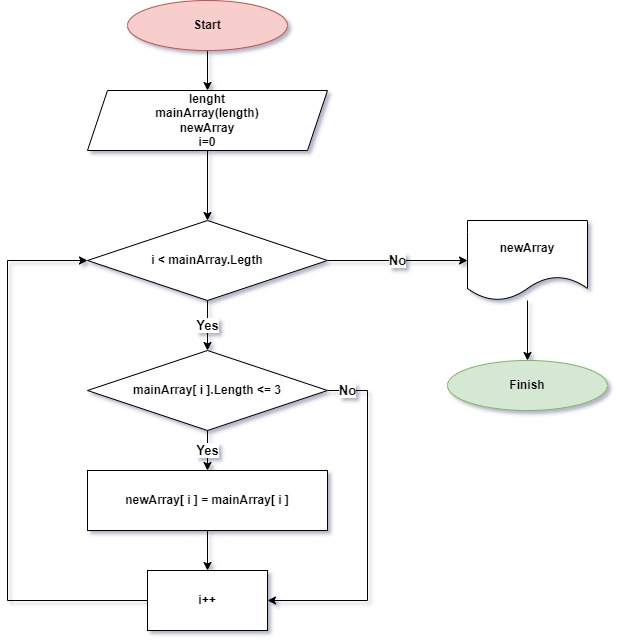

**Задача:**
 
*Написать программу, которая из имеющегося массива строк формирует новый массив из строк, длина которых меньше, либо равна 3 символам. Первоначальный массив можно ввести с клавиатуры, либо задать на старте выполнения алгоритма. При решении не рекомендуется пользоваться коллекциями, лучше обойтись исключительно массивами.*

***Примеры:***

* [“Hello”, “2”, “world”, “:-)”] → [“2”, “:-)”]

* [“1234”, “1567”, “-2”, “computer science”] → [“-2”]

* [“Russia”, “Denmark”, “Kazan”] → []

***Решение***
1) Составляем блок-схему c алгоритмом решения задачи:

    Алгоритм простой:
    * Два массива - один дан, другой будем создавать на основе первого(указав такую-же длинну)
    * Дальше, методом перебора элементов исходного массива, создаем итоговый массив.
    Делаем это заполняя элементами первого массива (по порядку), которые попадают в интервал ограничений.
    * В данном случае ограничениями являются:
        - Количество пройденных циклов при подборе элементов (будет равно кол-ву элементов исходного массива)
        - Ограничение количества символов каждого добавляемого элемента итогового массива (в данной задаче не больше 3-х)
    * Выводим итоговый массив

2) Пишем программу на языке C#:

* создаем файл Program.cs (dotnet new console)
* записываем исходный массив (строчного типа данных - string)
* создаем итоговый массив (строчного типа данных - string) с длинной, равной длинне исходного массива
* в решении используем два метода типа void
(один метод выполняет условие задачи и создает итоговый массив, другой выводит созданный массив)  

